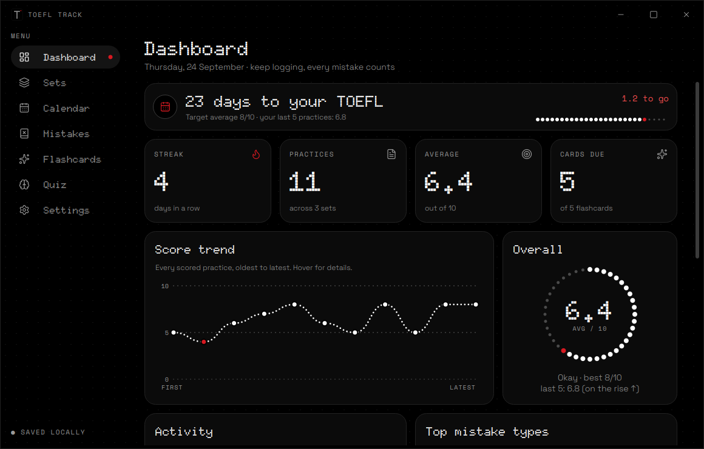
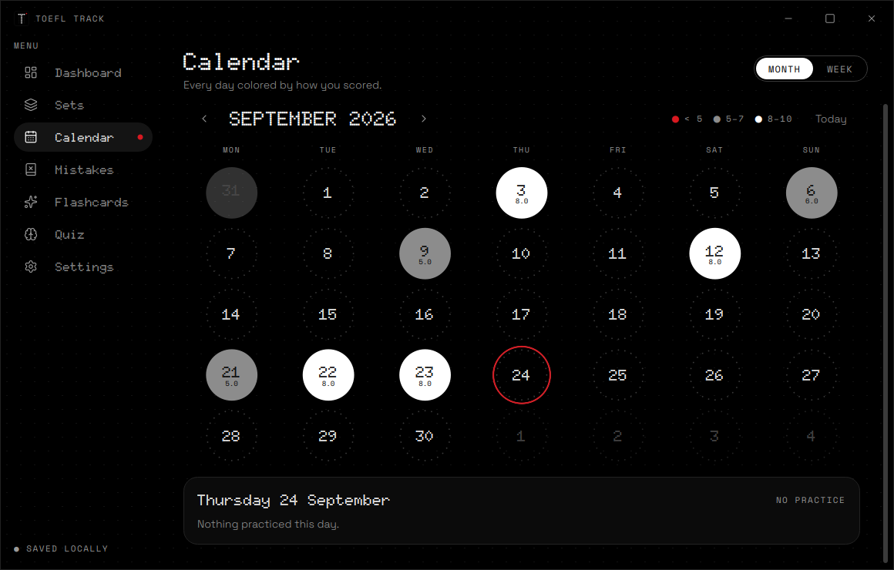

# TOEFL Track

A small desktop app for tracking TOEFL practice, in a Nothing OS–inspired look: AMOLED black, white, one red, dot-matrix type and dots everywhere.



**Set → Practice → score out of 10 → mistakes** (the wrong answer, the correct one, the mistake type and the topic).

- **Dashboard:** streak, practice count, average, cards due, a dotted score trend, a score ring, an activity heatmap, top mistake types and recent practices.
- **Sets:** one card per set with its average and a dot sparkline. Open a set to see its practices.
- **Calendar:** your scores by **month** or by **week**. Each day is colored by its average: red below 5, grey from 5 to 7, white from 8 to 10, and the number is always shown next to the color. Click a day to list its practices, and click a practice to open it.
- **Practice editor:** pick the score from 0 to 10 by clicking or by typing a digit. Type a mistake and press **Enter** to add it, and double-click a cell to edit it. Everything saves automatically.
- **Mistakes:** every wrong answer in one searchable list, filtered by type or set. Double-click a row to open its practice, or right-click it to add it to flashcards.
- **Flashcards:** a word list with flip-card reviews and spaced repetition. Grade each card with 1 Again, 2 Hard, 3 Good or 4 Easy. There are three ways to add cards, and they all work together:
  - one at a time with **Add card**
  - from any mistake with **Add to flashcards**
  - many at once with **Paste list** (see below)
- **Quiz:** see your old wrong answer and type the correct one. "I was right" accepts a correct answer written differently.
- **Exam and streak:** set your test date and target average to get a countdown and an "on track" check.
- **Settings:** exam date and target, open the data folder, export to CSV, and turn motion down.



## Paste a word list

In **Flashcards → Paste list**, put one card per line, with the word, a colon and then its meaning:

```
car:vehicle you use to transport
lie:you don't say the right thing
```

Words you already have are skipped unless you tick "Update the meaning of words I already have". Lines without a colon are listed so you can fix them.

**Only have plain words?** Click **Copy AI prompt** and paste the prompt into ChatGPT, Claude or Gemini, followed by your words. It answers in the format above, ready to paste back.

## Download

The [Releases](https://github.com/jazzmedoalt/toefl-track/releases) page has two files:

- **TOEFL-Track.exe**: Windows, portable, with no install.
- **TOEFL-Track-x86_64.AppImage**: Linux. Run `chmod +x` on it, or open it with [Gear Lever](https://flathub.org/apps/it.mijorus.gearlever), which reads the app name, icon, description and screenshots and can **update it** from new GitHub releases.

## Portable data

Everything is stored in `toefl_data.db`, **next to the app file** (and next to the `.AppImage` on Linux). To move your progress, copy the app and that file. If the folder is read-only, the data goes to `%APPDATA%\TOEFL Track` on Windows or `~/.local/share/toefl-track` on Linux.

## Build

GitHub Actions builds both files on every push. They appear under **Actions → the latest run → Artifacts**. Pushing a tag, e.g. `git tag v1.2.0 && git push --tags`, attaches them to a Release.

To run it from source:

```bash
python -m venv .venv
.venv/bin/pip install -r requirements.txt      # Windows: .venv\Scripts\pip
.venv/bin/python run.py
```

To build on your own machine (each build runs on the OS it's building for):

```bash
.venv/bin/pip install pyinstaller
.venv/bin/pyinstaller --noconfirm --clean toefl_track.spec   # Windows → dist/TOEFL-Track.exe
tools/build_appimage.sh .venv/bin                            # Linux → dist/TOEFL-Track-x86_64.AppImage
```

## Credits

- UI: PySide6 (Qt 6). License: MIT (see `LICENSE`).
- Fonts: [Doto](https://github.com/oliverlalan/Doto), [Space Grotesk](https://github.com/floriankarsten/space-grotesk) and [Space Mono](https://github.com/googlefonts/spacemono), all under the SIL OFL.
- Icons: [Lucide](https://lucide.dev) (ISC).
- The look is inspired by Nothing OS. This is not an official Nothing product.
